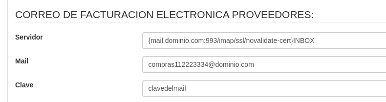

# RECEPCIÓN DE DTE

## DTE: DOCUMENTO TRIBUTARIO ELECTRÓNICO

Este módulo permite capturar los documentos emitidos por los proveedores.
 Los documentos compatibles son: facturas de compra, notas de crédito y notas de débito.

## Normativa SII:
Por normativa los proveedores de facturación electrónica deben realizar el siguiente proceso:

-   🔲 **Enviar el Xml Dte al sii via webservice.

-   🖥 **Enviar el Xml Dte al cliente via correo. 

## Correo para Compras:
Se recomienda crear un correo para uso exclusivo de las compras.
 Además en la casilla de correo se debe crear una carpeta con el nombre <b>leidos</b>
 Cuando la plataforma va capturando los correos los va moviendo a la carpeta leidos.

## Configuración del Módulo:
La configuracion se realiza en <b>Menú: Compras > Mantención > Configuración</b>
 En la sección Correo Compras se deben configurar los siguientes parámetros.

-   01.-Host: {mail.dominio.cl:993/imap/ssl/novalidate-cert}INBOX
-   02.-Correo: compras112223334@dominio.cl
-   03.-Clave: clavedelmail

Imagen de ejemplo:

## Informar correo en el sii:
El correo se debe informar al sii siguiendo los siguientes pasos

 
